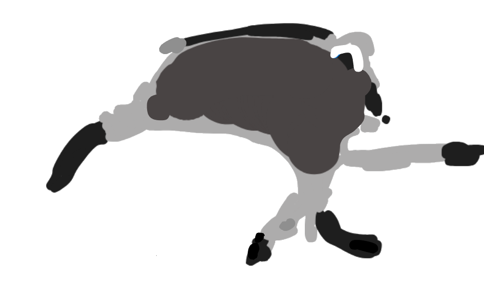

# Framothy

Framothy is a small TypeScript framework for creating and rendering virtual DOM elements.

---

## Installation

Install the package from npm:

```bash
npm install framothy
```

## Creating an Element

```ts
const heading = createElement("h1", { class: "title" }, "Hello from Framothy");
```

This creates a virtual node that describes an `h1` element.

## event handling

```ts
const button = createElement(
  "button",
  { onclick: () => console.log("Button clicked!") },
  "MyButton",
);
```

this creates a button with an event handling the click

---

## Complete Usage Example

```ts
import { createElement, render } from "framothy";

// Create a nested UI structure.
const App = createElement(
  "div",
  { id: "app-root", class: "container" },
  createElement("h1", { class: "title" }, "Framothy App"),
  createElement("p", {}, "A simple virtual DOM example."),
  createElement("button", { onclick: () => console.log("Button clicked!") }, "MyButton")
  createElement(
    "ul",
    { class: "list" },
    ["Item 1", "Item 2", "Item 3"].map((item) =>
      createElement("li", { class: "item" }, item),
    ),
  ),
);


// Mount the UI to the page.
const container = document.getElementById("root");
if (container) {
  render(App, container);
}
```

The page must contain a mount element:

```html
<div id="root"></div>
```

---

## Virtual DOM

### `vNode`

```ts
type vNode = {
  type: string;
  props: Record<string, any>;
  children: (vNode | string)[];
};
```

The `vNode` type describes a virtual DOM node:

- `type` is the element name, such as `div` or `p`.
- `props` contains the element's attributes.
- `children` contains nested virtual nodes or text strings.

### `createElement`

Creates a virtual DOM node from an element name, its attributes, and any nested children.

```ts
createElement(
  type: string,
  props: Record<string, any> = {},
  ...children: (vNode | string)[]
): vNode;
```

- `type` is the HTML tag for the element, such as `div`, `h1`, or `button`.
- `props` is an optional object of attributes, like `class`, `id`, or `disabled`.
- `children` can include text, nested virtual nodes, or arrays of either.

### `render`

Renders a virtual DOM node inside an existing DOM container.

```ts
render(vNode: vNode, container: HTMLElement): void;
```

The `render` function converts the virtual node into a real DOM element and appends it to the provided container.

During rendering, `render` calls the function `mount` who:

- creates a DOM element from the node's `type`;
- applies each entry in `props` as an HTML attribute; and
- recursively renders child nodes or appends text children.

---

## State Management

### `StateManager<T>`

Manage application state and automatically notify listeners when state changes.

```ts
const state = new StateManager({ count: 0 });
```

#### `getState()`

Returns the current value of the state.

```ts
const store = new StateManager({ count: 0 });
console.log(store.getState()); // { count: 0 }
```

#### `setState(newValue)`

Replaces the current state.

```ts
state.setState({ count: 1 });
```

#### `subscribe(callback)`

Registers a callback to run whenever state changes. Returns a function to unsubscribe.

```ts
state.subscribe(() => render(App(), document.getElementById("app")!));
```

The callback receives `(newState, previousState)` and triggers the function whenever state updates.

#### `notify(newState, previousState)`

Manually triggers all subscribed listeners with new and previous state values.

```ts
const counter = new StateManager({ count: 0 });
counter.notify({ count: 2 }, { count: 1 });
```

### Example

```ts
import { createElement, render, StateManager } from "framothy";

const state = new StateManager({ count: 0 });

function App() {
  return createElement(
    "div",
    {},
    createElement("h1", {}, "test-project"),
    createElement("p", {}, "Count: " + state.getState().count),
    createElement(
      "button",
      { onclick: () => state.setState({ count: state.getState().count + 1 }) },
      "+1",
    ),
  );
}

state.subscribe(() => render(App(), document.getElementById("app")!));

render(App(), document.getElementById("app")!);
```

---
